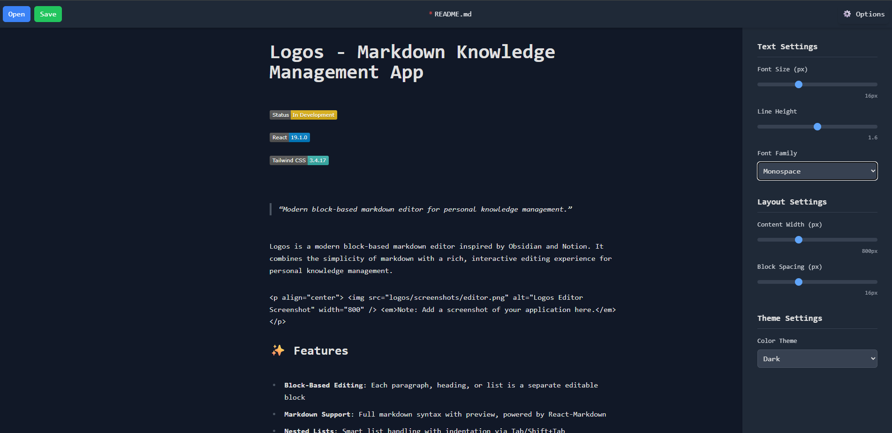

# Logos - Markdown Knowledge Management App


> Modern block-based markdown editor for personal knowledge management.

Logos is a modern block-based markdown editor inspired by Obsidian and Notion. It combines the simplicity of markdown with a rich, interactive editing experience for personal knowledge management.

<p align="center">
  
  <em>Note: Add a screenshot of your application here.</em>
</p>

## ✨ Features

- **Block-Based Editing**: Each paragraph, heading, or list is a separate editable block
- **Markdown Support**: Full markdown syntax with preview, powered by React-Markdown
- **Nested Lists**: Smart list handling with indentation via Tab/Shift+Tab
- **Theme Customization**: Toggle between light, dark, and sepia themes
- **Typography Settings**: Customize font size, line height, and spacing
- **File Operations**: Save to and load from markdown (.md) files
- **Context Menu**: Right-click to insert various content blocks
- **Keyboard Navigation**: Move between blocks using arrow keys

## 🧠 Main Philosophies

The core principles that guide the development of Logos:

### Privacy-First, Local-First Architecture
- All data stays on your device by default
- **Sync features must be a free option**, never paywalled
- Your knowledge base belongs to you, not the cloud

### Modular and Extensible Design
- Tailor the application to your specific needs
- Plugin system for extending functionality
- Community-driven extensions for specialized workflows

### AI-Augmented Knowledge Creation (Yeah... I know this is a bit controversal)
- AI features enhance rather than replace human thinking
- Focus on knowledge retrieval, not generic content generation
- Intelligent recommendations based on your existing knowledge base

### Customizable Experience
- Personalize the interface with widgets and components
- Adjust colors, spacing, and layout to your preference
- Create the perfect environment for your thinking process

### Open Development
- Transparent roadmap and decision-making
- Community feedback drives feature priorities
- **Sync will always remain a free option**

## 🚀 Getting Started

### Prerequisites

- Node.js (v16 or later)
- npm or yarn

### Installation

1. Clone the repository:

```bash
git clone https://github.com/yourusername/logos.git
cd logos
```

2. Install dependencies:

```bash
npm install
# or
yarn install
```

3. Start the development server:

```bash
npm start
# or
yarn start
```

4. Open [http://localhost:3000](http://localhost:3000) in your browser to see the app.

## 🧰 Usage

### Basic Editing

- Click on any block to edit its content
- Press Enter to create a new block
- Press Shift+Enter to create a line break within the same block
- Use standard markdown syntax for formatting

### List Management

- Create lists with `- `, `* `, `+ ` or `1. `
- Press Tab to indent a list item (create a sublist)
- Press Shift+Tab to outdent a list item
- Press Enter on an empty list item to break out of the list

### Navigation

- Use the up and down arrow keys to navigate between blocks when cursor is at the beginning/end of a block
- Click the settings icon to customize your editing experience

### File Operations

- Click "Save" to save your current document as a markdown file
- Click "Open" to load an existing markdown file
- Changes are tracked and you'll be warned if you try to close with unsaved changes

## 🛠️ Technologies Used

- **React**: UI framework for building the interface
- **Tailwind CSS**: Styling and responsive design
- **React-Markdown**: Markdown parsing and rendering
- **remark-gfm**: GitHub Flavored Markdown support
- **File System Access API**: For file operations

## 🔍 Project Structure

```
logos/
├── public/               # Static files
├── src/                  # Source code
│   ├── components/       # React components
│   │   ├── MarkdownBlock.js  # Individual block editor
│   │   ├── MarkdownEditor.js # Main editor component
│   │   ├── OptionsPanel.js   # Settings panel
│   │   ├── ContextMenu.js    # Right-click menu
│   │   └── Notification.js   # Notification component
│   ├── utils/            # Utility functions
│   │   └── fileOperations.js # File handling utilities
│   ├── App.js            # Main app component
│   └── index.js          # Entry point
└── README.md             # This file
```

## 🔮 Future Enhancements

- [ ] Auto-save functionality
- [ ] Backlinks and references
- [ ] Graph view of notes
- [ ] Tagging system
- [ ] Search functionality
- [ ] Desktop app support via Tauri
- [ ] Multiple panes for simultaneous editing
- [ ] Drag and drop for block reordering

## 🤝 Contributing

Contributions are welcome! Please feel free to submit a Pull Request.

1. Fork the project
2. Create your feature branch (`git checkout -b feature/amazing-feature`)
3. Commit your changes (`git commit -m 'Add some amazing feature'`)
4. Push to the branch (`git push origin feature/amazing-feature`)
5. Open a Pull Request

## 📝 License

This project is licensed under the MIT License - see the LICENSE file for details.

## 🙏 Acknowledgments

- Inspired by [Obsidian](https://obsidian.md/) and [Notion](https://notion.so/)
- Built with [React](https://reactjs.org/) and [Tailwind CSS](https://tailwindcss.com/)
- Markdown rendering powered by [React-Markdown](https://github.com/remarkjs/react-markdown)

---

<p align="center">Made with ❤️ by Joshua Gonzales</p>
